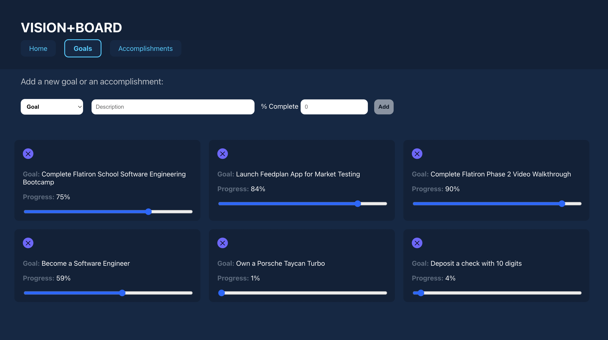

# React Phase 2 project

This app is a web-based goal board like the one I have hanging up in my office. It was created with React. Here's a short video walkthrough: [YouTube Walkthrough](https://youtu.be/2RCQT0jVLjU)

 

 

### **Form**

The form on the page allows you to select whether you want to post a new item to the Goal Board or the Accomplishment Board -- Users are able to POST goals/accomplishments, UPDATE progress, and DELETE goals/accomplishments.

The form is dynamic and only shows the fields that are relevant to the Goals and Accomplishments wall.

### **Client-Side Routes**

The project includes 3 client-side routes using React Router in the NavBar.

### **CSS Styling**

Custom CSS styling throughout with a consistant UI theme.

### **Sources**

None
